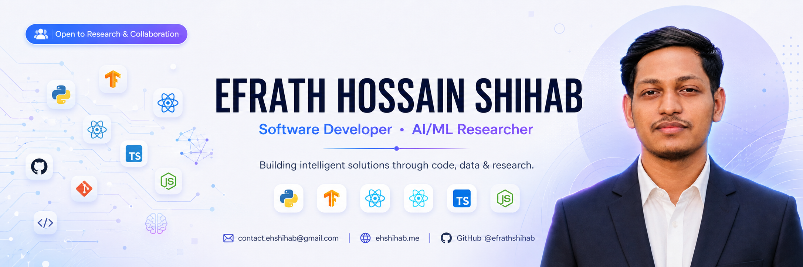

<!-- ═══════════════════════════════════════════════════════════════════════════
     EFRATH HOSSAIN SHIHAB — GitHub Profile README
     ─────────────────────────────────────────────
     REPLACE: All occurrences of "efrathshihab" with your actual GitHub username
              if it differs from the current value.
     ═══════════════════════════════════════════════════════════════════════════ -->

<div align="center">

<!-- ── HERO BANNER ─────────────────────────────────────────────────────────── -->



[](https://git.io/typing-svg)


&nbsp;
[](https://github.com/efrathshihab?tab=followers)
&nbsp;
[](https://github.com/efrathshihab?tab=repositories)


</div>

---

<!-- ── ABOUT ME ──────────────────────────────────────────────────────────────── -->

## About Me

<table>
<tr>
<td valign="top" width="55%">

```yaml
name     : Efrath Hossain Shihab
location : Dhaka, Bangladesh 🇧🇩
role     : Full-Stack Developer & Content Creator
education: CSE @ AIUB

interests:
  - Full Stack Development
  - Machine Learning & Data Engineering
  - Video Editing & Visual Storytelling
  - Open Source & Community Building

learning : React · Node.js · ML Pipelines · Cloud Technologies

current_focus:
  - Ship 3 Production-Ready Full-Stack Apps
  - Complete an ML Certification
  - Contribute to Open Source Projects
  - Lead & Grow Student Media Communities
```

</td>
<td valign="middle" width="45%" align="center">


</td>
</tr>
</table>

<br/>

---

<!-- ── TECH STACK ────────────────────────────────────────────────────────────── -->

## Tech Stack

<div align="center">

| Category | Technologies |
|:---:|:---|
| **Frontend** |      |
| **Backend** |   |
| **Database** |   |
| **Languages** |     |
| **Design & Media** |     |
| **Tools** |     |

</div>

<br/>

---

<!-- ── GITHUB ANALYTICS ──────────────────────────────────────────────────────── -->

## GitHub Analytics

<div align="center">

<!-- Activity Graph -->


</div>

<br/>

<!--
═══════════════════════════════════════════════════════════
  FEATURED PROJECTS — commented out, not in use right now.
  Uncomment this entire block when you're ready to add projects.
═══════════════════════════════════════════════════════════

---

── FEATURED PROJECTS ──────────────────────────────────────
REPLACE: Update each project's title, description, tech stack, repo link,
         and live demo URL with your actual project details.

## Featured Projects

<div align="center">

<table>
<tr>
<td width="50%" valign="top">

### Project One
REPLACE: Add your actual project title

A brief, punchy description of what this project does and the problem it solves. Keep it to 1–2 sentences.

**Stack:** `React` `Node.js` `Express` `MySQL`

[](https://github.com/efrathshihab/REPO-NAME-HERE)
[](https://your-live-demo-link.com)

</td>
<td width="50%" valign="top">

### Project Two
REPLACE: Add your actual project title

A brief, punchy description of what this project does and the problem it solves. Keep it to 1–2 sentences.

**Stack:** `Python` `JavaScript` `HTML/CSS`

[](https://github.com/efrathshihab/REPO-NAME-HERE)
[](https://your-live-demo-link.com)

</td>
</tr>
<tr>
<td width="50%" valign="top">

### Project Three
REPLACE: Add your actual project title

A brief, punchy description of what this project does and the problem it solves. Keep it to 1–2 sentences.

**Stack:** `React` `Tailwind CSS` `Firebase`

[](https://github.com/efrathshihab/REPO-NAME-HERE)

</td>
<td width="50%" valign="top">

### Project Four
REPLACE: Add your actual project title

A brief, punchy description of what this project does and the problem it solves. Keep it to 1–2 sentences.

**Stack:** `C#` `SQL Server`

[](https://github.com/efrathshihab/REPO-NAME-HERE)

</td>
</tr>
</table>

</div>

<br/>

---
-->

<!-- ── DETAILED STATS ──────────────────────────────────────────────────────── -->

## Detailed Stats

<div align="center">


<br/>

<table width="90%">
<tr>
<td width="50%" align="center">

</td>
<td width="50%" align="center">

</td>
</tr>
<tr>
<td width="50%" align="center">

</td>
<td width="50%" align="center">

</td>
</tr>
</table>

</div>

<br/>

---

<!-- ── ACHIEVEMENTS ──────────────────────────────────────────────────────────── -->

## Achievements

| Year | Achievement |
|------|-------------|
| 2024 | Led digital content operations for **The Daily AIUB** — one of Bangladesh's largest student media platforms |
| 2024 | Managed brand identity and social media for **The Daily University** |
| 2023 | Completed foundational coursework in Data Structures, OOP, and Database Systems at AIUB |
| 2023 | Built and published first full-stack web project independently |
<!-- REPLACE: Update these with your actual achievements and years -->

<br/>

---

<!-- ── CONNECT WITH ME ───────────────────────────────────────────────────────── -->

## Connect

<div align="center">

[](https://www.linkedin.com/in/efrathshihab/)
[](https://github.com/efrathshihab)
[](https://www.facebook.com/efrathshihab)
[](https://www.instagram.com/efrath_shihab/)
[](https://x.com/efrathshihab71)
[](https://www.youtube.com/@efrathshihab07)
[](https://wa.me/8801784448415)
[](mailto:contact.ehshihab@gmail.com)

</div>

<br/>

---

<!-- ── QUOTE ─────────────────────────────────────────────────────────────────── -->

<div align="center">

> *"First, solve the problem. Then, write the code."*
> — John Johnson

</div>

<br/>

---

<!-- ── FOOTER ─────────────────────────────────────────────────────────────────── -->

<div align="center">


**Thanks for visiting.** If something here resonates with you, feel free to reach out.


</div>
