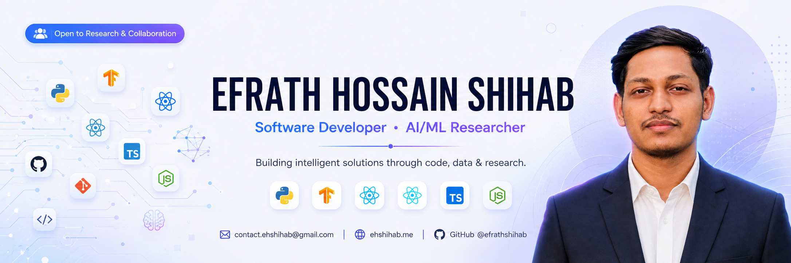

<!--
  EFRATH HOSSAIN SHIHAB · GitHub Profile README
  Sections: Hero · About · Tech Stack · Featured Work · Research · GitHub Stats · Journey · Connect
  Lines marked TODO need a link or a detail only you can fill in.
-->

<div align="center">

<!-- ───────────── HERO ───────────── -->



<br/>

[](https://eh-shihab.me)

[](https://eh-shihab.me)
[](https://www.linkedin.com/in/efrathshihab/)
[](mailto:contact.ehshihab@gmail.com)


[](https://github.com/efrathshihab?tab=followers)
[](https://github.com/efrathshihab?tab=repositories)

<br/>

[About](#about-me) &nbsp;·&nbsp; [Tech Stack](#tech-stack) &nbsp;·&nbsp; [Featured Work](#featured-work) &nbsp;·&nbsp; [Research](#research) &nbsp;·&nbsp; [Stats](#github-stats) &nbsp;·&nbsp; [Connect](#connect)

</div>

---

<!-- ───────────── ABOUT ───────────── -->

## About Me

I'm a Computer Science and Engineering student at AIUB. I build full-stack web apps, run a student news platform, and do research in applied machine learning.

<table>
<tr>
<td valign="top" width="58%">

```yaml
name     : Efrath Hossain Shihab
based_in : Dhaka, Bangladesh 🇧🇩
studying : CSE @ AIUB

roles:
  - Full-Stack Developer (MERN)
  - Founder, The Daily AIUB
  - Co-founder, Adfoxx Marketing Communications

working_on:
  - The Daily AIUB news portal
  - Deep learning for plant disease classification

interests:
  - Full-Stack Development
  - Machine Learning & Computer Vision
  - UI/UX & Visual Storytelling
  - Open Source & Community Building
```

</td>
<td valign="middle" width="42%" align="center">


</td>
</tr>
</table>

---

<!-- ───────────── TECH STACK ───────────── -->

## Tech Stack

| &nbsp; | Technologies |
|:--|:--|
| **Frontend** |        |
| **Backend** |   |
| **Database** |    |
| **Languages** |     |
| **Design & Media** |     |
| **Tools** |       |

---

<!-- ───────────── FEATURED WORK ───────────── -->

## Featured Work

<table>
<tr>
<td width="50%" valign="top">

### The Daily AIUB

A university news portal with Google sign-in, JWT authentication, and an editorial interface that supports dark and light modes.

**Stack:** `MongoDB` `Express` `React` `Node.js`

<!-- TODO: add your live site and/or repo link, e.g.
[](https://YOUR-LIVE-URL)
[](https://github.com/efrathshihab/YOUR-REPO)
-->

</td>
<td width="50%" valign="top">

### Biometric Voting System

An offline election system that combines face recognition with embedded hardware. Published as a peer-reviewed paper in 2025.

**Stack:** `Face Recognition` `Embedded Systems`

[](https://doi.org/10.9734/jerr/2025/v27i71580)

</td>
</tr>
<tr>
<td width="50%" valign="top">

### Betel Leaf Disease Classification

A deep learning model that identifies betel leaf diseases from images. Research in progress.

**Stack:** `Python` `Deep Learning` `Computer Vision`


</td>
<td width="50%" valign="top">

### Personal Portfolio

My portfolio site, tuned for fast loading with code splitting and optimized assets.

**Stack:** `React` `Vite` `Tailwind CSS` `Vercel`

[](https://eh-shihab.me)

</td>
</tr>
</table>

---

<!-- ───────────── RESEARCH ───────────── -->

## Research

**Published**

> **A Biometric Voting Solution: Integrating Face Recognition with Embedded Systems for Secure Offline Elections**
> <br/>*Journal of Engineering Research and Reports*, Vol. 27(7), 2025
> <br/>[](https://doi.org/10.9734/jerr/2025/v27i71580)

**In progress**

- Deep learning for betel leaf disease classification

---

<!-- ───────────── GITHUB STATS ───────────── -->

## GitHub Stats

<div align="center">

<!-- Each card has a light and a dark version, so it matches the visitor's GitHub theme. -->

<picture>
  <source media="(prefers-color-scheme: dark)" srcset="https://github-profile-summary-cards.vercel.app/api/cards/profile-details?username=efrathshihab&theme=github_dark"/>
  
</picture>

<picture>
  <source media="(prefers-color-scheme: dark)" srcset="https://github-profile-summary-cards.vercel.app/api/cards/repos-per-language?username=efrathshihab&theme=github_dark"/>
  
</picture>
<picture>
  <source media="(prefers-color-scheme: dark)" srcset="https://github-profile-summary-cards.vercel.app/api/cards/most-commit-language?username=efrathshihab&theme=github_dark"/>
  
</picture>

<picture>
  <source media="(prefers-color-scheme: dark)" srcset="https://github-profile-summary-cards.vercel.app/api/cards/stats?username=efrathshihab&theme=github_dark"/>
  
</picture>
<picture>
  <source media="(prefers-color-scheme: dark)" srcset="https://github-profile-summary-cards.vercel.app/api/cards/productive-time?username=efrathshihab&theme=github_dark&utcOffset=6"/>
  
</picture>

<br/><br/>

<picture>
  <source media="(prefers-color-scheme: dark)" srcset="https://github-readme-activity-graph-bay-five.vercel.app/graph?username=efrathshihab&bg_color=0d1117&color=c9d1d9&title_color=58a6ff&line=58a6ff&point=ffa657&area=true&area_color=58a6ff&hide_border=true&radius=8"/>
  
</picture>

</div>

---

<!-- ───────────── JOURNEY ───────────── -->

## Journey

<!-- TODO: check the years and wording below -->

| Year | Milestone |
|:--:|:--|
| **2025** | Published a peer-reviewed paper on biometric voting in the *Journal of Engineering Research and Reports* |
| **2024** | Led digital content operations for **The Daily AIUB**, one of Bangladesh's largest student media platforms |
| **2024** | Managed brand identity and social media for **The Daily University** |
| **2023** | Built and published my first full-stack web project independently |

---

<!-- ───────────── CONNECT ───────────── -->

## Connect

<div align="center">

[](https://eh-shihab.me)
[](https://www.linkedin.com/in/efrathshihab/)
[](mailto:contact.ehshihab@gmail.com)
[](https://github.com/efrathshihab)

[](https://www.facebook.com/efrathshihab)
[](https://www.instagram.com/efrath_shihab/)
[](https://x.com/efrathshihab71)
[](https://www.youtube.com/@efrathshihab07)
[](https://wa.me/8801784448415)

<br/>

> *"First, solve the problem. Then, write the code."*
> <br/>— John Johnson

<br/>

<!-- ───────────── FOOTER ───────────── -->

<picture>
  <source media="(prefers-color-scheme: dark)" srcset="https://capsule-render.vercel.app/api?type=waving&color=0:0d1117,50:1a1f2e,100:0d1117&height=100&section=footer"/>
  
</picture>

**Thanks for visiting.** If something here resonates with you, feel free to reach out.

</div>